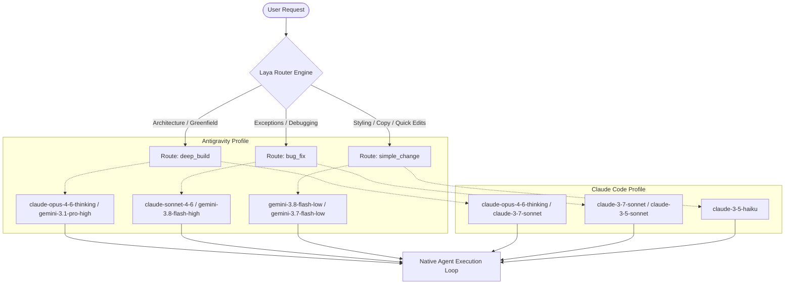

# Laya Router: Adaptive Model Routing for AI Coding Agents

[](https://github.com/theo-odore/laya-plugin)
[](https://github.com/theo-odore/laya-plugin)
[](https://www.python.org/)
[](https://github.com/ConvAI-Innovation/Laya)
[](LICENSE)

**Laya Router** is an intelligent, task-aware model-selection plugin and decision layer designed for modern AI coding agents — including **Antigravity (`agy`)**, **Claude Code**, and autonomous agent pipelines.

Instead of manually toggling models between large architectural initiatives and small cosmetic tweaks, Laya Router classifies incoming tasks in real time, evaluates complexity, and dynamically routes each request to the optimal model for the active agent runtime.

---

## The Problem

In agentic software development, different tasks demand vastly different reasoning budgets:
- **Architectural engineering** (e.g., building a greenfield microservice or full-stack application) requires deep reasoning models with expansive context awareness.
- **Debugging & crash analysis** requires high-precision diagnostic reasoning.
- **Minor tweaks** (e.g., changing CSS colors, adjusting margins, fixing typos) do not warrant expensive reasoning models and are best handled by ultra-fast, low-latency models.

Manually switching models via CLI arguments or settings throughout a coding session creates unnecessary friction. **Laya Router makes coding agents task-aware and adaptive**, optimizing intelligence, turnaround latency, and cost while keeping the native agent workflow intact.

---

## Core Architecture

Laya Router operates as a non-invasive decision layer across agent platforms:

```text
User Request / Prompt
         ↓
Coding Agent CLI (Antigravity / Claude Code / etc.)
         ↓
  Laya Router Layer
         ↓
[ Task Classification ] ──→ deep_build / bug_fix / simple_change
         ↓
[ Model Mapping ]       ──→ Target Model & Effort Selection
         ↓
Native Coding Agent
         ↓
Files / Terminal / Browser / Project Context
```



---

## Multi-Agent Route Matrix & Model Mapping

Laya maps requests across three canonical operational routes, configured per agent platform:

### 1. Antigravity Profile (`agy`)
| Route | Example Prompt | Target Model | Effort | Role |
| :--- | :--- | :--- | :--- | :--- |
| **`deep_build`** | *"Build a complete hospital management system"* | `claude-opus-4-6-thinking` *(fallback: `gemini-3.1-pro-high`)* | `high` | Architectural planning, multi-file code generation, complex refactoring |
| **`bug_fix`** | *"Fix the appointment page crash"* | `claude-sonnet-4-6` *(fallback: `gemini-3.8-flash-high`)* | `high` | Root cause isolation, stack trace debugging, regression resolution |
| **`simple_change`** | *"Change the button color to blue"* | `gemini-3.8-flash-low` *(fallback: `gemini-3.7-flash-low`)* | `low` | UI tweaks, wording/copy adjustments, documentation tweaks |

### 2. Claude Code Profile
| Route | Example Prompt | Target Model | Effort | Role |
| :--- | :--- | :--- | :--- | :--- |
| **`deep_build`** | *"Build a complete hospital management system"* | `claude-opus-4-6-thinking` *(fallback: `claude-3-7-sonnet`)* | `high` | Multi-step reasoning and systemic development |
| **`bug_fix`** | *"Fix the appointment page crash"* | `claude-3-7-sonnet` *(fallback: `claude-3-5-sonnet`)* | `medium` | Targeted bug fixing, test failures, and diagnostics |
| **`simple_change`** | *"Change the button color to blue"* | `claude-3-5-haiku` | `low` | Fast single-file changes, comments, small tweaks |

*Note: Custom agent profiles can be defined in `laya_router/config.py`.*

---

## Key Features

- **Multi-Agent Plugin Architecture**: Ships with native plugin manifests for **Antigravity** (`plugin/plugin.json`) and **Claude Code** (`.claude-plugin/plugin.json`).
- **Dynamic Turn-by-Turn Re-evaluation**: Re-assesses each prompt dynamically so that task shifts during a long project session (e.g., transitioning from architecture to bug fixing) adapt automatically.
- **Sub-Millisecond Warm Daemon**: An optional background worker keeps the Laya neural router resident in memory, delivering routing decisions in **<15ms**.
- **Confidence & Calibration Guardrails**: Uses raw softmax probability distributions to enforce confidence gating. If confidence drops below `50%`, the router automatically falls back to a safe default model.
- **Universal CLI Launcher (`laya`)**: Launch or resume agent sessions directly with automated `--model` and `--effort` pre-selection across Antigravity and Claude Code.
- **Auditable Telemetry**: Records routing history, token probabilities, and model transitions in `.laya/routing_history.jsonl`.

---

## Project Structure

```text
laya-plugin/
├── .claude-plugin/
│   └── plugin.json              # Claude Code plugin manifest
├── cli/
│   └── laya_cli.py              # CLI launcher (laya run, laya chat, laya classify)
├── commands/
│   └── laya.toml                # Native /laya slash command
├── hooks/
│   ├── pre_invocation.py        # Antigravity PreInvocation lifecycle hook
│   └── claude_prompt_hook.py    # Claude Code UserPromptSubmit hook
├── laya_router/
│   ├── __init__.py
│   ├── config.py                # Multi-agent profiles (Antigravity, Claude Code, Generic)
│   ├── decision.py              # Laya decision model & fallback engine
│   ├── daemon.py                # Ultra-fast resident background worker
│   └── client.py                # Dual-mode client (daemon query + in-process fallback)
├── plugin/
│   ├── plugin.json              # Antigravity plugin manifest
│   ├── hooks.json               # Lifecycle hook registration
│   └── skills/
│       └── laya-router/
│           └── SKILL.md         # Antigravity skill definition
├── tests/
│   └── test_router.py           # Comprehensive unit tests
├── pyproject.toml               # Package definition and CLI entrypoints
└── README.md
```

---

## Installation & Setup

### 1. Prerequisites
- Python 3.9+
- Antigravity CLI (`agy`) and/or Claude Code CLI (`claude`)
- PyTorch / Transformers (automatically pulled by `laya`)

### 2. Install Python Dependencies
```bash
git clone https://github.com/theo-odore/laya-plugin.git
cd laya-plugin
pip install -e .
```

### 3. Agent Integration

#### For Antigravity (`agy`)
Install the plugin using the official `agy plugin` manager:
```powershell
agy plugin install ./plugin
```
Verify:
```powershell
agy plugin list
```

#### For Claude Code
Symlink or copy the repository into your Claude Code plugins directory or enable via `.claude-plugin/plugin.json`.

---

## Usage

### 1. Universal CLI Launcher (`laya`)

#### Launch with Antigravity
```bash
laya run "Build a complete hospital management system"
# Automatically runs: agy --model claude-opus-4-6-thinking --effort high -p "..."
```

#### Launch with Claude Code
```bash
laya run --agent claude_code "Fix the appointment page crash"
# Automatically runs: claude --model claude-3-7-sonnet -p "..."
```

#### Classify and Inspect Route Probabilities
```bash
laya classify "Refactor the database connection pool"
```
Output:
```text
[Laya Decision Engine] Analyzing task for [antigravity]: "Refactor the database connection pool"

--- Laya Routing Decision ---
  Agent Platform: antigravity
  Route:          deep_build
  Confidence:     84.6%
  Target Model:   claude-opus-4-6-thinking
  Effort:         high
  Probabilities:
    deep_build       84.6%  [################    ]
    bug_fix          11.2%  [##                  ]
    simple_change     4.2%  [#                   ]
-----------------------------
```

### 2. Python API

Integrate Laya Router directly into any custom agent workflow:

```python
from laya_router import route_prompt

# Route for Antigravity
decision = route_prompt("Build an analytics dashboard with websockets", profile="antigravity")
print(decision.route)         # "deep_build"
print(decision.target_model)  # "claude-opus-4-6-thinking"

# Route for Claude Code
decision_cc = route_prompt("Change the button color to blue", profile="claude_code")
print(decision_cc.route)         # "simple_change"
print(decision_cc.target_model)  # "claude-3-5-haiku"
```

---

## Running the Test Suite

Run the full automated test suite covering prompt extraction, model mapping, confidence gating, and canonical classification:

```bash
python tests/test_router.py
```

Expected output:
```text
[Test] Verifying model mappings...
  --> Model mappings OK
[Test] Verifying transcript prompt extraction...
  --> Transcript prompt extraction OK
[Test] Verifying confidence threshold & fallback logic...
  --> Confidence & fallback gating OK
[Test] Running canonical task routing tests with Laya...
  Prompt: "Build a complete hospital management system"
    -> Route: deep_build (Confidence: 89.82%)
    -> Target Model: claude-opus-4-6-thinking (Effort: high)
  Prompt: "Fix the appointment page crash"
    -> Route: bug_fix (Confidence: 72.59%)
    -> Target Model: claude-sonnet-4-6 (Effort: high)
  Prompt: "Change the button color to blue"
    -> Route: simple_change (Confidence: 91.95%)
    -> Target Model: gemini-3.8-flash-low (Effort: low)
  --> Canonical routing OK

ALL ROUTER TESTS PASSED SUCCESSFULLY!
```

---

## License

This project is licensed under the MIT License - see the [LICENSE](LICENSE) file for details.
