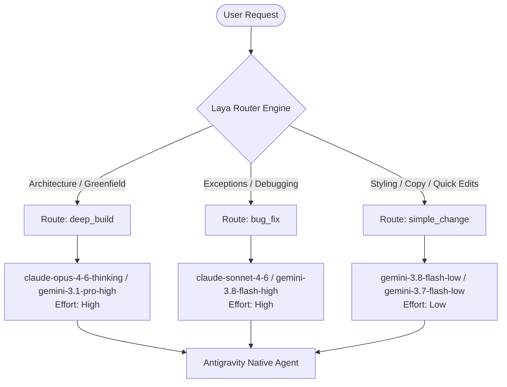

# Laya Router for Antigravity

[](https://github.com/theo-odore/laya-plugin)
[](https://www.python.org/)
[](https://github.com/ConvAI-Innovation/Laya)
[](LICENSE)

**Laya Router** is an intelligent, task-aware model-selection plugin and decision layer designed specifically for the **Antigravity CLI (`agy`)**.

Instead of manually switching models between large architectural requests and minor bug fixes, Laya Router automatically classifies incoming tasks, evaluates task complexity, and dynamically binds each request to the optimal Antigravity model.

---

## The Problem

In agentic software development, different tasks demand vastly different reasoning budgets:
- **Architectural engineering** (e.g. building a greenfield microservice or full-stack application) requires deep reasoning models with expansive context awareness.
- **Debugging & crash analysis** requires high-precision diagnostic models.
- **Minor tweaks** (e.g. changing CSS colors, adjusting margins, fixing typos) do not warrant expensive reasoning models and are best handled by ultra-fast, low-latency models.

Manually toggling models via CLI arguments or settings throughout a coding session creates friction. **Laya Router makes Antigravity task-aware and adaptive**, optimizing intelligence, latency, and cost while leaving the native agent execution loop completely intact.

---

## Core Architecture

Laya Router operates as a non-invasive decision layer inside Antigravity:

```text
User Request / Prompt
         ↓
  Antigravity CLI (agy)
         ↓
  Laya Router Plugin
         ↓
[ Task Classification ] ──→ deep_build / bug_fix / simple_change
         ↓
[ Model Mapping ]       ──→ Target Model & Effort Selection
         ↓
Native Antigravity Agent
         ↓
Files / Terminal / Browser / Project Context
```



---

## Route Matrix & Model Mapping

Laya maps requests across three canonical operational routes matched against verified Antigravity models:

| Route | Example Prompt | Antigravity Target Model | Reasoning Effort | Role |
| :--- | :--- | :--- | :--- | :--- |
| **`deep_build`** | *"Build a complete hospital management system"* | `claude-opus-4-6-thinking` *(fallback: `gemini-3.1-pro-high`)* | `high` | Architectural planning, multi-file code generation, complex refactoring |
| **`bug_fix`** | *"Fix the appointment page crash"* | `claude-sonnet-4-6` *(fallback: `gemini-3.8-flash-high`)* | `high` | Root cause isolation, stack trace debugging, regression resolution |
| **`simple_change`** | *"Change the button color to blue"* | `gemini-3.8-flash-low` *(fallback: `gemini-3.7-flash-low`)* | `low` | UI tweaks, wording/copy adjustments, documentation tweaks |
| **Fallback** | *Ambiguous / Low-confidence prompt* | `gemini-3.8-flash-high` | `high` | Safe general-purpose fallback |

---

## Key Features

- **Native Antigravity Lifecycle Hook (`PreInvocation`)**: Automatically intercepts turns right before model dispatch, extracts prompt context from `transcript.jsonl`, and injects routing guidance into the session.
- **Dynamic Turn-by-Turn Re-evaluation**: Re-assesses each turn dynamically so that task shifts during a long session (e.g. moving from building a feature to fixing an error) adapt automatically.
- **Sub-Millisecond Warm Daemon**: An optional background worker keeps the Laya neural router resident in memory, delivering routing decisions in **<15ms**.
- **Confidence & Calibration Guardrails**: Uses raw softmax probability distributions to enforce confidence gating. If confidence drops below `50%`, the router automatically fails safe to `gemini-3.8-flash-high`.
- **Standalone `laya` CLI Launcher**: Launch or resume Antigravity sessions directly with automated `--model` and `--effort` pre-selection.
- **Auditable Telemetry**: Records routing history, token probabilities, and model transitions in `.laya/routing_history.jsonl`.

---

## Project Structure

```text
laya-plugin/
├── cli/
│   └── laya_cli.py              # CLI launcher (laya run, laya chat, laya classify)
├── commands/
│   └── laya.toml                # Native Antigravity /laya slash command
├── hooks/
│   └── pre_invocation.py        # Antigravity PreInvocation lifecycle hook
├── laya_router/
│   ├── __init__.py
│   ├── config.py                # Model mappings, criteria, and daemon config
│   ├── decision.py              # Laya decision model & fallback engine
│   ├── daemon.py                # Ultra-fast resident background worker
│   └── client.py                # Dual-mode client (daemon query + in-process fallback)
├── plugin/
│   ├── plugin.json              # Antigravity plugin manifest
│   ├── hooks.json               # Lifecycle hook registration
│   └── skills/
│       └── laya-router/
│           └── SKILL.md         # Antigravity skill definition
├── tests/
│   └── test_router.py           # Comprehensive unit tests
├── pyproject.toml               # Package definition and CLI entrypoints
└── README.md
```

---

## Installation & Setup

### 1. Prerequisites
- Python 3.9+
- Antigravity CLI (`agy`) installed and configured
- PyTorch / Transformers (automatically pulled by `laya`)

### 2. Install Python Dependencies
```bash
git clone https://github.com/theo-odore/laya-plugin.git
cd laya-plugin
pip install -e .
```

### 3. Install Plugin into Antigravity
Install the plugin using the official `agy plugin` manager:

```powershell
agy plugin install ./plugin
```

Verify that the plugin is recognized:
```powershell
agy plugin list
```
Output:
```json
{
  "name": "laya-router",
  "source": "antigravity",
  "components": ["skills", "commands", "hooks"]
}
```

---

## Usage

### 1. Standalone CLI Launcher (`laya`)

#### Run a Single Task (Print Mode)
```bash
laya run "Build a complete hospital management system"
# Automatically runs: agy --model claude-opus-4-6-thinking --effort high -p "..."
```

#### Continue an Existing Session with Adaptive Routing
```bash
laya run -c "Fix the appointment page crash"
# Resumes session with: agy --model claude-sonnet-4-6 --effort high -c ...
```

#### Interactive Chat Session
```bash
laya chat "Change the button color to blue"
```

#### Inspect Task Route & Probabilities
```bash
laya classify "Refactor the database connection pool"
```
Output:
```text
[Laya Decision Engine] Analyzing task: "Refactor the database connection pool"

--- Laya Routing Decision ---
  Route:        deep_build
  Confidence:   84.6%
  Target Model: claude-opus-4-6-thinking
  Effort:       high
  Probabilities:
    deep_build       84.6%  [################    ]
    bug_fix          11.2%  [##                  ]
    simple_change     4.2%  [#                   ]
-----------------------------
```

### 2. In-Session Antigravity Integration

When working inside a standard Antigravity session, the **`PreInvocation` hook runs automatically before every turn**.

If a task matches a different tier than your active model, Laya injects an ephemeral directive:
```text
[Laya Router] Task Route: `deep_build` (Confidence: 89.8% | Probabilities: deep_build: 90%, bug_fix: 6%, simple_change: 4%)
  Optimal Antigravity Model: `claude-opus-4-6-thinking` (effort: high)
  Current Active Model: `gemini-3.8-flash-high`
  [Adaptive Guidance] Align reasoning depth and tool invocation strategy with the `deep_build` route.
```

You can also run `/laya` inside Antigravity at any time to inspect current routing metrics.

---

## Running the Test Suite

Run the full automated test suite covering prompt extraction, model mapping, confidence gating, and canonical classification:

```bash
python tests/test_router.py
```

Expected output:
```text
[Test] Verifying model mappings...
  --> Model mappings OK
[Test] Verifying transcript prompt extraction...
  --> Transcript prompt extraction OK
[Test] Verifying confidence threshold & fallback logic...
  --> Confidence & fallback gating OK
[Test] Running canonical task routing tests with Laya...
  Prompt: "Build a complete hospital management system"
    -> Route: deep_build (Confidence: 89.82%)
    -> Target Model: claude-opus-4-6-thinking (Effort: high)
  Prompt: "Fix the appointment page crash"
    -> Route: bug_fix (Confidence: 72.59%)
    -> Target Model: claude-sonnet-4-6 (Effort: high)
  Prompt: "Change the button color to blue"
    -> Route: simple_change (Confidence: 91.95%)
    -> Target Model: gemini-3.8-flash-low (Effort: low)
  --> Canonical routing OK

ALL ROUTER TESTS PASSED SUCCESSFULLY!
```

---

## License

This project is licensed under the MIT License - see the [LICENSE](LICENSE) file for details.
